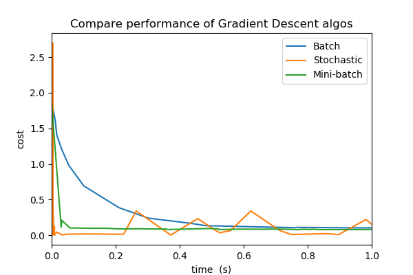

# Comparing different Gradient Descent algorithms

Code is provided for batch, stochastic and mini-batch gradient descent algorithms. These algorithms are tested against artifically generated data and their relative performances are then compared. A brief intro to the theory behind gradient descent is also provided in the Notebook.

### Overview of Gradient Descent

Gradient descent, in the context of Machine Learning, aims to optimise parameter values such that a cost function is minimised. This process is shown in action below using the Batch Gradient Descent algorithm applied to our dummy data. In this example, our initial guess at our parameter values, *theta*, is steadily improved with each iteration. After around 5000 iterations our predicted parameter values almost perfectly converge on those that were used to generate the dummy data.

  

### Comparing different methods

When updating our cost and gradient at each iteration, we can choose to base this update on values from all of our data (Batch), some of our data (Mini-Batch) or just 1 observation (Stochastic). Each of these methods has their pros and cons, but the main points to note are that:

- **Batch Gradient Descent** will always decrease the cost function with each iteration,. However, as it uses all the data available in each decison made, this process can take longer than other methods.
- **Stochastic Gradient Descent** will approach our minimum faster but it will never truly converge due to natural variation in our data. This method is more likely to avoid local minima than the batch method though due to the randomness involved.
- **Mini-Batch Gradient Descent** aims to combine the best of both worlds. Here, we update our theta parameters more frequently than in the batch method, but we also manage to lose some of the noise that we see in the Stochastic approach.

The below plot shows the peformance of each of these methods on our dummy data. We can see that for small dataasets, we might want to use the Batch method for the most accurate results. However, for large datasets we are likely to want to use the mini-batch method as it will converge on decent parameter values much quicker. Mini-batch is the most favoured approach for modern ML challenges.

  

